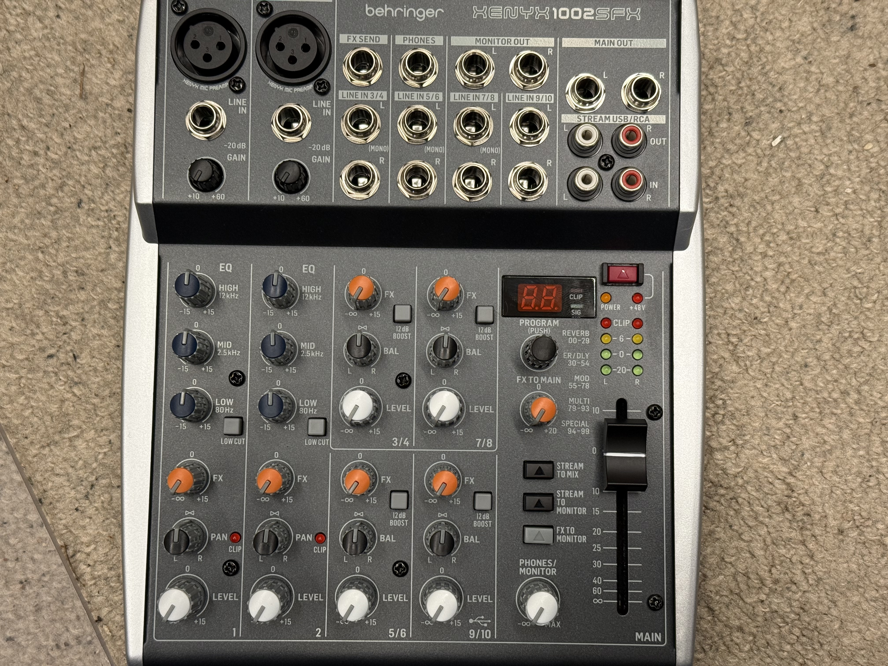
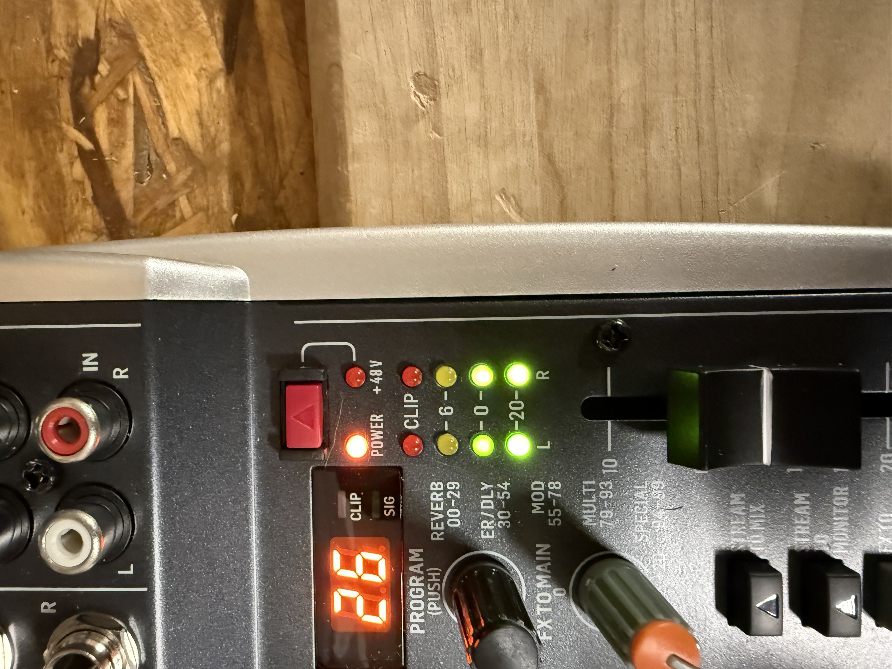
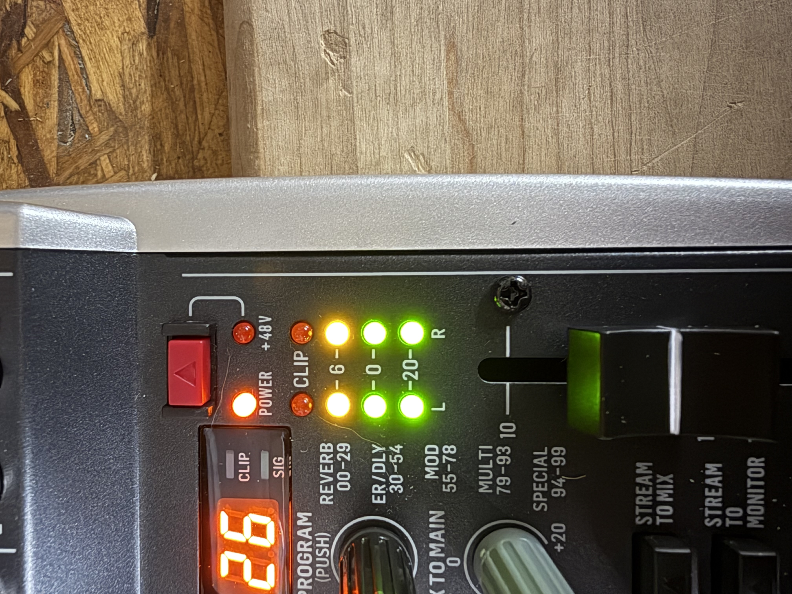
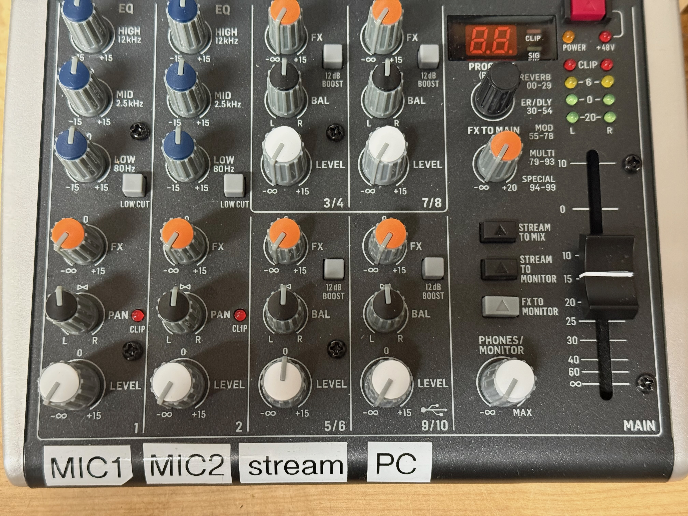
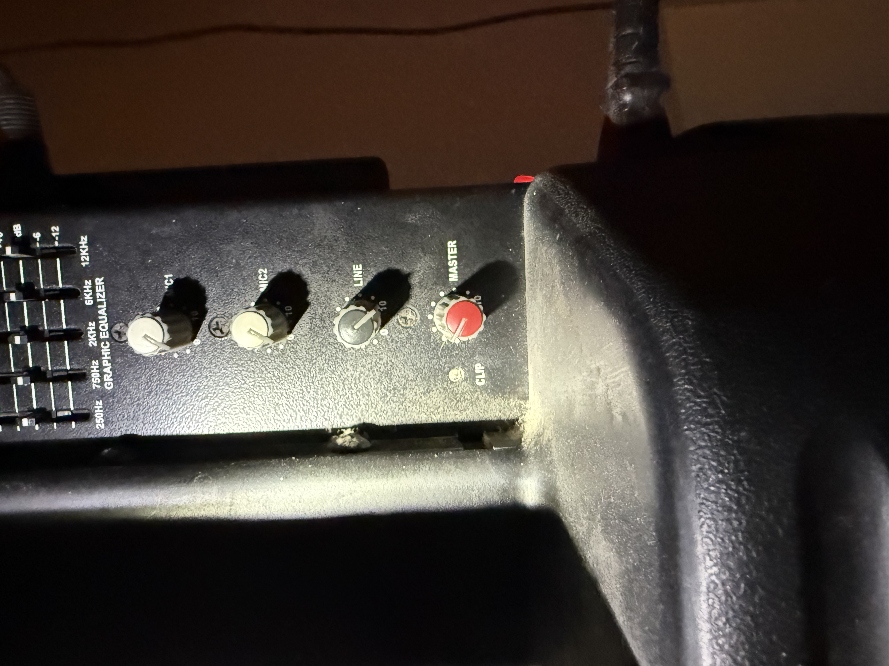
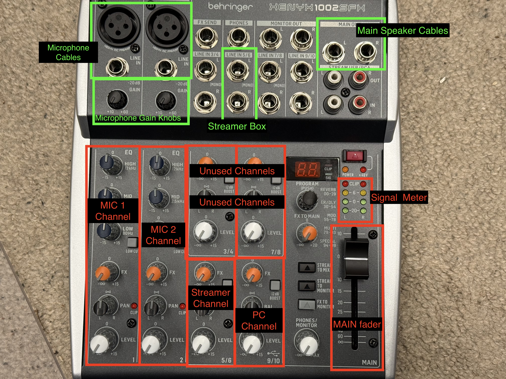

This document is intended to help people who are not audio engineers operate a small soundboard in a very specific venue.  The author is not an audio engineer.  This document should NOT be considered a technically correct "soundboard bible"

# Terminology:

* __CCW__:  CounterClockWise or "turn the knob to the left".  "Fully CCW" means "turn to the left until it stops."
* __CW__: ClockWise "turn the knob to he right"
* __12 o'clock, 3 o'clock, etc__:  The position the knob would be in if the mark on the knob were a hand on a clock.  e.g. a knob at 3 o'clock would have the mark pointing directly to the right
* __fader__: Another name for the LEVEL control knobs and the MAIN sliding volume control

# Setup Procedures

Most of these procedures build on one another.  For example, the karaoke procedure assumes the board has been set up for playing music from the PC, which assumes the board is in a specific state covered in _Starting Position_.  

## Playing music from the PC (short version)

This assumes the board has not been meaningfully tinkered with since it was set up properly (see the verbose version of this procedure, _Playing music from the PC (long version)_, if this shorter one fails).  

2. Move the __MAIN__ fader all the way to the bottom
2. Check that the __LEVEL__ knob (white) for __channels 9/10__ (also labeled "PC") is set between 3 o'clock and 12 o'clock.  If the knob is in this range don't touch it.  If it's outside this range set it to 3 o'clock.  
3. Check that all the other __LEVEL__ knobs (white) are __fully CCW__
2. Confirm the PC is set to play music to the __USB Audio CODEC__
2. Set the system and application volume to 100%
3. Start the music on the PC
4. _Slowly_ move the __MAIN__ fader up to adjust the volume 

## Starting Position

All other procedures except the short version of _Playing music from the PC_ assume the board is in the state described here:

1. The two small black __GAIN__ knobs at the top left of the board are turned __fully CCW__
1. All __LEVEL__ (white) knobs are turned __fully CCW__
2. All __FX__ (orange) knob are turned __fully CCW__
3. All __EQ__ (dark blue) knobs are at __12 o'clock__.  Note only the microphone channels have EQ knobs.
4. All __PAN/BAL__ (black) knobs are at __12 o'clock__.  These knobs are labeled PAN on the microphone channels and BAL on the other channels.  
5. __All buttons__ are __up__, which is equivalent to __off__.  Fully press a button to toggle the up/down state.  If you are new to using this board, press one of the buttons a couple times to make sure you are familiar with the positions.  
6. __MAIN__ fader is __all the way down__ (towards the infinity symbol)
8. __Unplug__ the __MAIN OUT__ connectors in the upper right corner of the board.  
7. The number displayed under __PROGRAM__ is not important.  Ignore the black knob under the display as it is just used to change the number and doesn't have a specific position it can be set to.  

## Playing music from the PC (long version)

This procedure should not have to be done often.  Usually you can use the short version of this procedure.

1. Make sure the board is in the __Starting Position__ (see other sections of this document)
1. Select __USB Audio CODEC__ as the audio output device on the computer.  	TODO more detail here
5. Set the __system volume__ on the computer to __maximum__ or __100%__  
6. Set the  __video or music app volume__ (e.g. YouTube or Spotify) to __maximum__ or __100%__, if the application offers volume control 
7. __Start__ playing the music on the computer
3. Move the __MAIN__ fader up until the line on the knob is even with the line labeled __0__ (zero)
8. Slowly_ turn the __LEVEL__ knob (white) for __channels 9/10__ (also labeled "PC") __CW__ while watching the second set of green lights (labeled with a zero) above the MAIN fader.  The lights will vary as the music plays, and the goal is to have the zero lights mostly or steadily lit, and the yellow lights just flickering at the loudest parts of the song.  The red CLIP lights should never illuminate.  Usually the knob will be somewhere between 12 o'clock and 3 o'clock.  

Here is an example of the green "zero"LEDs lit up:

Here is an example of the yellow LEDs lit up:

9. _THIS IS VERY IMPORTANT_ Move the __MAIN__ fader __all the way down__ (towards the infinity symbol).  If you forget this step you will make very loud noises and maybe damage some equipment.  
10. __DOUBLE CHECK YOU MOVED THE MAIN FADER ALL THE WAY DOWN__
10. __Plug in__ the appropriate cables to the __MAIN OUT__ sockets in the upper right corner of the board.  They will be labeled MAIN OUT R and MAIN OUT L.  Plug the cables into the R and L sockets, respectively.  
11.  _Slowly_ move the __MAIN__ fader up until the volume is to your liking.  

## Playing Music from the Streamer Box

This procedure assumes you are already successfully playing music from the PC at an appropriate volume.  

1. Leave the __MAIN__ fader where it is
1. Note the position of the __LEVEL__ knob (white) for __channels 9/10__ (also labeled "PC").  Then turn the knob **fully CCW**.  
1. Connect your phone to the streamer box, start the music, and set your phone volume to maximum.  You have to be on the **staff wifi network** to see the streamer box
2. The __BOOST__ button for __channels 7/8__ should be __ON__ (down).  Press the button to toggle it and confirm the position.
8. Slowly turn the __LEVEL__ knob (white) for __channels 7/8__ (also labeled "stream") __CW__ until the volume is to your liking.  

To switch back to the PC, turn the **LEVEL** knob for the stream channel **fully CCW**.  Turn the **LEVEL** knob for ther PC back to where it was.  

## Karaoke with microphones 

This procedure calls for an assistant to speak into the microphone, but you can also provide microphone input yourself.  

1.  Start by following the procedure for __Playing music from the PC__
2.  Pause the music
2. Confirm the __LEVEL__ knobs and the __GAIN__ knobs for the __MIC 1__ channel are **fully CCW** (the MIC 1 channel is the vertical row of knobs on the far left of the board)
2.  Note the position of the __MAIN__ fader, then move it all the way down.
3.  Plug the microphone into the channel labeled __MIC 1__ at the top.  Details on connecting the microphone will be covered elsewhere
4.  Note there is a small red light labeled __CLIP__ next to the PAN knob, and a small black knob labeled __GAIN__ at the top of the board near where the microphone cable plugs in.  You will use these in the next step
5. Have your assistant speak or sing into the microphone at a typical performance volume.  Slowly turn the __GAIN__ knob CW, while watching the __CLIP__ light.  When the __CLIP__ light starts to flash, turn the __GAIN__ knob __CCW__ about one sixteenth of a turn (22 degrees).  Don't worry about the exact amount you turn the knob...we're not building a spaceship here.     
5.  Continue watching the __CLIP__ light to make sure it isn't flashing while your assistant sings or speaks.  Adjust the knob CW or CCW as needed
5.  Set the __LEVEL__ knob (white) to 12 o'clock as a starting point
5.  While your assistant speaks or sings, slowly move the __MAIN__ fader to the position noted in step 4.  *Quickly* move the __MAIN__ fader to the bottom if there is any feedback. Keep your hand on the fader for the next step.  
6.  Start the music.  *Quickly* move the __MAIN__ fader to the bottom if there is any feedback.  Now you will use the __LEVEL__ knobs on the channels for __MIC 1__ and __9/10__ to adjust the microphone and music volumes until they are reasonable relative to one another.  
7. Once the relative volumes ("mix") are good you may find the overall volume is too loud or too quiet.  Use the __MAIN__ fader to adjust the volume without affecting the mix.  Watch the lights above the __MAIN__ slider--the red CLIP lights should never light up.  
8. Note you may need to adjust the __LEVEL__ knobs up or down as songs or performers vary in volume.  If you have a particularly loud performer, you may need to turn down the GAIN, but this will likely require readjusting the LEVEL and MAIN faders again.  

### Adding a second microphone

1. Note the position of the __MAIN__ fader, then move it all the way to the bottom
2. Follow steps 5 through 10 in the _Karaoke with microphones_ procedure for setting the microphone gain and levels.  
3. Start the music.  Now you will use the LEVEL knobs on the __MIC 1__ and __MIC 2__ channels, and channel __9/10__ so the microphone and music volumes are reasonable relative to one another.
4. Follow steps 12 through 13 in the _Karaoke with microphones_ procedure

## Adjusting the Speakers

You will never need to make adjustments to the speakers under normal circumstances.  Everything can be adjusted at the soundboard.  

This procedure is provided in case the speaker settings are tampered with.  The correct settings for the speakers are:

* The knobs for **MIC1** and **MIC2** should be **fully CCW**
* **LINE** knob should be **FULLY CW** 
* **MASTER** knob should be at 10 o'clock
* The equalizer sliders should all be in the middle.  There should be a slight "click" where the slider settles in the middle.  

# Things you don't _really_ need to know (but might be useful)

**(feel free to skip this section)**

The board is divided into more or less six channels that you can control.  The microphone channels are on the left side of the board, with all of the inputs and controls arranged vertically.  The remaining four channels are in a 2x2 grid in the middle of the board and correspond to the labeled inputs at the top of the board.  

The sound board has a built in DAC (Digital/Analog Converter), and the board receives audio from the PC over USB.  We advise full volume out of the computer to reduce the possibility of the PC altering the digital signal.

## Connections

**(feel free to skip this section...unless you are trying to fix a mess someone else has made)**

* USB-A (rectangle) from computer to USB-B (square) on the back of the soundboard
* Left and right TRS connectors go from MAIN OUT to the big speakers in drop-in.  These are 6.35mm (1/4") diameter plugs with two plastic insulators on the body.  These are "balanced" cables and have XLR connectors on the other end where they connect to the speakers.  
* The streamer box is connected to the board on channels 5/6 using a cable that adapts the 3.5mm (1/8") TRS (stereo) connector from the streamer to two 6.35mm (1/4") TS (mono, right and left) connectors on board. The TS connectors have a single plastic insulator on the body.  
* Microphone connections may be 6.35mm (1/4") TS or XLR
* Power connection goes to the back of the soundboard
* You can optionally connect a set of headphones to the PHONES plug at the top of the board

----------

TODO Labels and pictures of connectors.  

speakers:

You will never need to make adjustments to the speakers under normal circumstances.  Everything can be adjusted at the soundboard.  The correct settings for the speakers are:

* The knobs for mic 1 and mic 2 should be all the way counterclockwise.  
* line in/line 1 knob should be at 12 o'clock.
* "master" knob should be at 1 o'clock
* The equalizer sliders should all be in the middle.  There should be a slight "click" where the slider settles in the middle.  

-----------------

https://homerecordinglab.com/how-to-set-proper-audio-recording-levels/

Set levels on the speakers amps:

Find 30 minutes when no one is using the space. Put everything at unity on the x32 and turn the power amps (or powered speakers) to zero. Put on a song you like. Start turning the amps up until it's "a couple clicks" louder than you want it. Then turn master down to your target volume. 

-----

Need to make sure this procedure actually works
Set the speaker amp volumes appropriately
How to solve feedback problems
NEED PICTURES
Figure out correct speaker amp setting.  Try LINE at max and adjust just the master volume knob. Use line knob to avoid any clipping.    
